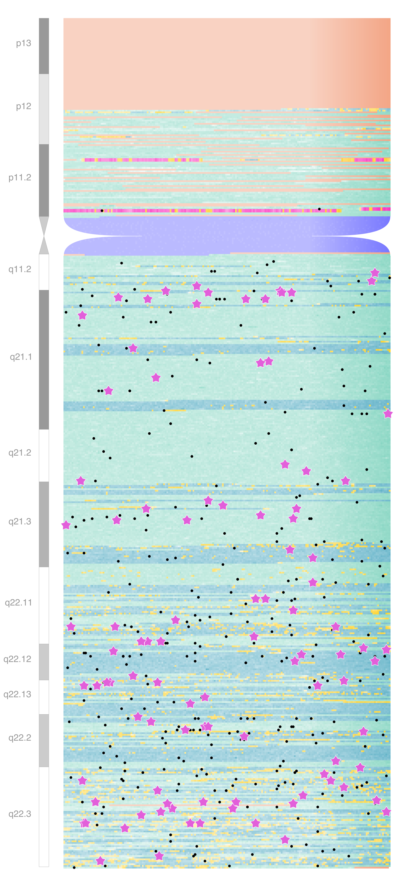
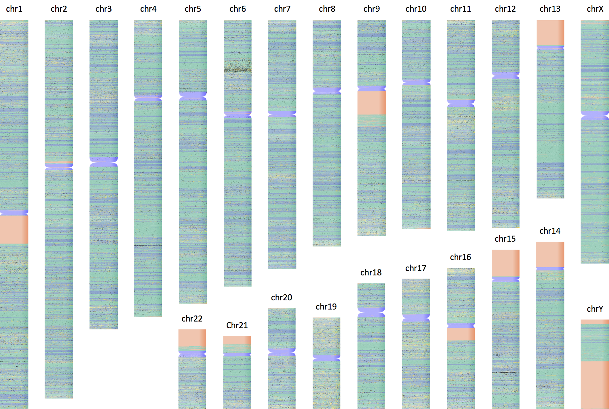

## GenomePlotter

The motivation behind this project was to create a scientifically correct visualization of the human genome with showing the location of protein coding genes,
exons, already published genome-wide associations and many more. I chose a heat-map kind of visualization that allows the representation of the underlying chemical
properties of the DNA ([GC content](https://en.wikipedia.org/wiki/GC-content)) as well.

### Approach

The project is divided into two parts:

1. A shell script that downloads and pre-processes the source data files with genome sequence, GWAS signals, gene annotation and the [cytobands](https://en.wikipedia.org/wiki/G_banding).
2. A python script, that combines all source data into a single data-frame and creates the final plots.

### Requirements

**Required bash tools:**
* [cairo graphics library](https://www.cairographics.org/download/)
* [tabix](http://www.htslib.org/download/)
* [bedtools](http://bedtools.readthedocs.io/en/latest/content/installation.html) v2.27 or above

**Besides standard libraries, the following python packages were used:**

* [pandas](https://pandas.pydata.org/)
* [numpy](http://www.numpy.org/)
* [cairosvg](http://cairosvg.org/)
* [pybedtools](https://pypi.python.org/pypi/pybedtools)

### Source data:

All applied source data is mapped to the GRCh38 build of the human genome.

* **The sequnce of the human genome** is dowloaded from [Ensembl](http://www.ensembl.org/info/data/ftp/index.html) (checking for the most recent version).
* **Genome wide association signals** most recent version of the NHGRI-EBI [GWAS catalog](https://www.ebi.ac.uk/gwas/) (checking the most recent version).
* **Gene annotation** gene coordinates are downloaded from [GENCODE](http://www.gencodegenes.org/releases/current.html) checking for the most recent version.
* **Cyto-bands** coordinates of the G-bands and centromeres are downloaded from the [UCSC genomics database](http://hgdownload.cse.ucsc.edu/goldenPath/hg38/database/cytoBand.txt.gz) (currently only the genomic coordinates of the centromeres are used.)

### Step 1 - Pre-processing.

```bash
./Prepare_data.sh <chunk_size>
```

* *<chunk_size>* the length of non-overlapping genomic regions which will be pooled together to calculate [GC content](https://en.wikipedia.org/wiki/GC-content) in basepairs. The default
value is 500bp
* The script creates a *source_data* folder into which all the necessary input files will be downloaded.
* Then all files will then be processed and saved into the *data/* folder.
* For each chromosome an indexed bed file will be generated containing the chromosome, start and end coordinates of the chunk and the GC content. This piece of information represent a single pixel of the resulting plot.
* Genomic regions where the sequence is not available, 'NA' is put in to the GC content field. (This will be the base of the coloring of the heterochromatic regions)

### Step 2 - Plot data.

```bash
./Genome_Plotter.py --help
```
```
usage: Genome_Plotter.py [-h] -c CHROMOSOME [-d DIMENSION] [-a AXIS]
                         [-p PIXEL] [-s DARKSTART] [-m DARKMAX] [-f FOLDER]
                         [-t TEST]

Script to plot chromosomes with elaborate annotations. See github:
https://github.com/DSuveges/GenomePlotter

optional arguments:
  -h, --help            show this help message and exit
  -c CHROMOSOME, --chromosome CHROMOSOME
                        Selected chromosome to process
  -d DIMENSION, --dimension DIMENSION
                        Fixed dimension (height of width) of the plot (200
                        chunks by default).
  -a AXIS, --axis AXIS  The fixed axis of the plot (1 - width, 2 - height, 1
                        by default)
  -p PIXEL, --pixel PIXEL
                        The size of a plotted chunk in pixel (default: 3).
  -s DARKSTART, --darkStart DARKSTART
                        Fraction of the width from where the colors start
                        getting darker (default: 0.75).
  -m DARKMAX, --darkMax DARKMAX
                        How dark a pixel can get at the right end of the plot
                        (default: 0.15).
  -f FOLDER, --folder FOLDER
                        The working directory (default is the current working
                        directory)
  -t TEST, --test TEST  The number of chunks to be read (by default the whole
                        chromosome is processed.)
```

The script at first assigns GENCODE feature to each chunk as follows: the default value is intergenic (colored in green), if a chunk has at least one base overlap with a gene then the chunk is considered to be gene (purple), unless the chunk has at least one basepair overlap with an exon in which case the cunk is consideret to be exon (colored in yellow), unless the GC content is NA, in which calse the chunk is considered to be heterochromatin (colored in salmon). Based on cyto-band annotation, chunks overlapping with centromeres will be colored in blue. The default color is adjusted based on the GC content.

The script then creates svg image and saves indicating the chromosome name, the specified dimension, and the chunks size for reproducibility. This svg file can further be edited. Then using cairosvg, a png file is also created and saved named identically.

About the requirements: processing a chromosome can take a long time (hours on a i7 3.1 GHz CPU) and uses upt to 2GB RAM.

### Result:

The following image was created based on the data of chromosome 19, where 450 bp-s were averaged to get GC content, and 200 of these chunks were plotted in each row.



The results of a genome-wide run:



### To-Dos

1. The G-bands will be added to the plot as well (at least to see how it would look). A separate plot will be generated with a "G-band" ruler with an alternating white/black colors and the names of the band. This plot will then be merged with the chromosome image.
2. Marking a custom set of associations read from a snp set file containing rsIDs, trait and paper title or PMID... adding as a symbol at first to see how it would look.
3. Adding the rsID and the trait to the plot in a speech bubble... it will be very tricky.
4. Adding further flexibility to the plot: custom pixel size and other features, proper command line option handling and error checking.
5. Extra script to generate figure legend and a script to create the whole composition.
