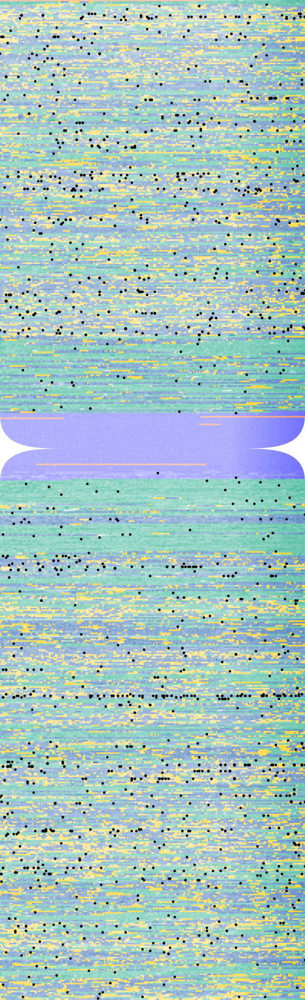

## GenomePlotter

The motivation behind this project was to visualize how genes and already known genome wide association signals are 
distributed across the chromosomes. I chose a heat-map kind of visualization that allows the representation of the underlying chemical
properties of the DNA (GC content) as well. In the most recent version of the visualization not only the protein coding genes are shown
but the exons are also highlighted in yellow. Constitutive heterochromatin (N-s in the fasta files) are colored in salmon, centromeres 
are in blue (coordinates of the centromeres are extracted from the cytoband dataset downloaded from UCSC). 

### Approach

The project is divided into two parts: 

1. A shell script that downloads and pre-processes the source data files with genome sequence, GWAS signals, gene annotation and the [cytobands](https://en.wikipedia.org/wiki/G_banding). 
2. A python script, that combines all source data into a single data-frame and creates the final plots.

### Requirements

**Required bash tools:**
* [cairo graphics library](https://www.cairographics.org/download/)
* [tabix](http://www.htslib.org/download/)
* [bedtools](http://bedtools.readthedocs.io/en/latest/content/installation.html) v2.27 or above

**Required Python packages:**

* [pandas](https://pandas.pydata.org/)
* [numpy](http://www.numpy.org/)
* [cairosvg](http://cairosvg.org/)
* [pybedtools](https://pypi.python.org/pypi/pybedtools)

### Source data:

All applied source data is mapped to the GRCh38 build of the human genome.

* **The sequnce of the human genome** was dowloaded from [Ensembl](http://www.ensembl.org/info/data/ftp/index.html) checked for the most recent version. 
* **Genome wide association signals** most recent version of the NHGRI-EBI [GWAS catalog](https://www.ebi.ac.uk/gwas/) downloading the most recent version.
* **Gene annotation** gene coordinates were downloaded from [GENCODE](http://www.gencodegenes.org/releases/current.html) checking for the most recent version. 
* **Cyto-bands** coordinates of the G-bands and centromeres were downloaded from the [UCSC genomics database](http://hgdownload.cse.ucsc.edu/goldenPath/hg38/database/cytoBand.txt.gz) (currently only the genomic coordinates of the centromeres are used.) 

### Step 1 - Pre-processing.

```bash
./Prepare_data.sh <chunk_size>
```

* *<chunk_size>* the length of non-overlapping genomic regions which will be pooled together to calculate GC content in basepairs. The default
value is 500bp 
* The script creates a *source_data* folder into which all the necessary input files will be downloaded.
* Then all files will then be processed and saved into the *data/* folder.
* For each chromosome an indexed bed file will be generated containing the chromosome, start and end coordinates of the chunk and the GC content. This piece of information represent a single pixel of the resulting plot. 
* Genomic regions where the sequence is not available, 'NA' is put in to the GC content field. (This will be the base of the coloring of the heterochromatic regions)

### Step 2 - Plot data.

```bash
./Genome_Plotter.py ${chr} ${dimension} ${axis} ${working_dir} ${chunks}
```

* **${chr}** chromosome name to process
* **${dimension}** how many chunks will be plotted in one row or one column.
* **${axis}** if the fixed dimension is row (2) or column (1). 
* **${working_dir}** directory from which the input files are read, by default it's the current working dir.
* **${chunks}** There's a chance to plot just a fraction of the chromosome for testing purposes. For this point, you can specify how many chunks do you want to be 
included in the set. This parameter is optional, if omitted, the whole chromosome will be processed and plotted. 

The script at first assigns GENCODE feature to each chunk as follows: the default value is intergenic (colored in green), if a chunk has at least one base overlap with a gene then the chunk is considered to be gene (purple), unless the chunk has at least one basepair overlap with an exon in which case the cunk is consideret to be exon (colored in yellow), unless the GC content is NA, in which calse the chunk is considered to be heterochromatin (colored in salmon). Based on cyto-band annotation, chunks overlapping with centromeres will be colored in blue. The default color is adjusted based on the GC content.

The script then creates svg image and saves indicating the chromosome name, the specified dimension, and the chunks size for reproducibility. This svg file can further be edited. Then using cairosvg, a png file is also created and saved named identically. 

### Result:

The following image was created based on the data of chromosome 19, where 450 bp-s were averaged to get GC content, and 200 of these chunks were plotted in each row. 



