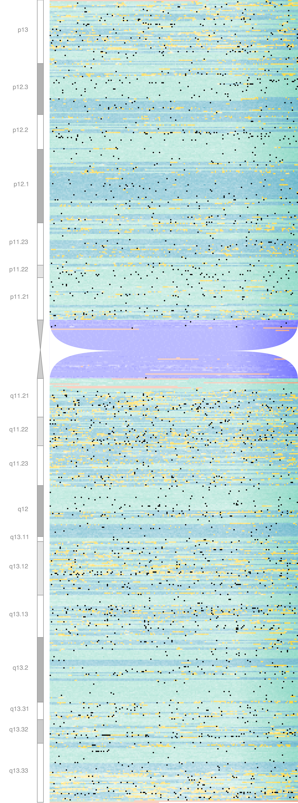

## GenomePlotter

The motivation behind this project was to create a scientifically correct visualization of the human genome with showing the location of genes, exons, already published genome-wide associations and many more. I chose a heat-map kind of visualization that allows the representation of the underlying chemical properties of the DNA ([GC content](https://en.wikipedia.org/wiki/GC-content)) as well.

### Approach

The project is divided into several parts:

1. A script (`Prepare_data.py`) that downloads and pre-processes the source data files with genome sequence, GWAS signals, gene annotation and the [cytological bands](https://en.wikipedia.org/wiki/G_banding).
2. A script (`plot_chromosome.py`), that integrates sequence data and gene annotation into a single svg (and png).
3. A script (`chromosome_annotator.py`) that uses the previously generated svg and adds various annotations (gwas signals, cytobands, custom annotation)

### Requirements

**Required bash tools:**

* [cairo graphics library](https://www.cairographics.org/download/)
* [bedtools](http://bedtools.readthedocs.io/en/latest/content/installation.html) v2.27 or above

**Besides standard libraries, the following Python packages were used:**

* [pandas](https://pandas.pydata.org/)
* [numpy](http://www.numpy.org/)
* [cairosvg](http://cairosvg.org/)
* [pybedtools](https://pypi.python.org/pypi/pybedtools)

### Source data:

All applied source data is mapped to the GRCh38 build of the human genome.

* **The sequnce of the human genome** is dowloaded from [Ensembl](http://www.ensembl.org/info/data/ftp/index.html) (checking for the most recent version).
* **Genome wide association signals** most recent version of the NHGRI-EBI [GWAS catalog](https://www.ebi.ac.uk/gwas/) (checking the most recent version).
* **Gene annotation** the most recent gene coordinates are downloaded from [GENCODE](http://www.gencodegenes.org/releases/current.html).
* **Cytological bands** coordinates fetched from the Ensembl [REST API](http://rest.ensembl.org/).

More information on the sources can be found in the `config.json` configuration file.

### Step 1 - Pre-processing

```bash
python Prepare_data.py -d data_folder/ -c config.json -l lofile.log -s 450 -t 0.5
```

help output:

```
usage: prepare_data.py [-h] -d DATADIR -c CONFIG [-l LOGFILE] -s CHUNKSIZE -t TOLERANCE

This script fetches and parses input data for the genome plotter project

optional arguments:
  -h, --help            show this help message and exit
  -d DATADIR, --dataDir DATADIR
                        Folder into which the input data and the temporary files will be saved
  -c CONFIG, --config CONFIG
                        JSON file with configuration data
  -l LOGFILE, --logfile LOGFILE
                        Name of the logfile
  -s CHUNKSIZE, --chunkSize CHUNKSIZE
                        Chunk size to pool genomic sequence
  -t TOLERANCE, --tolerance TOLERANCE
                        Fraction of a chunk that cannot be N.
```

* *<DATADIR>* folder into which the files are going to be saved.
* *<CONFIG>* JSON file containing the project level configuration. Will be used for multiple scripts
* *<LOGFILE>* information on the run is saved here.
* *<CHUNKSIZE>* the length of non-overlapping window used to pool together to calculate [GC content](https://en.wikipedia.org/wiki/GC-content). In basepairs. 
* *<TOLERANCE>* Ns are discarded from the GC content calculation. This float (ranging from 0-1) shows the maximum of Ns in a chunk tolerated. Chunks with too high N ratio is considered as heterochromatic region on the plot.


### Step 2 - Generate chromosome plot

```bash
./plot_chromosome.py --help
```

```
usage: plot_chromosome.py [-h] -c CHROMOSOME [-w WIDTH] [-p PIXEL]
                          [-s DARKSTART] [-m DARKMAX] [-f FOLDER] [-t TEST]
                          [-d] [--config CONFIG]

Script to plot genome chunks colored based on GC content and gene annotation.
See github: https://github.com/DSuveges/GenomePlotter

optional arguments:
  -h, --help            show this help message and exit
  -c CHROMOSOME, --chromosome CHROMOSOME
                        Selected chromosome to process
  -w WIDTH, --width WIDTH
                        Number of chunks in one row.
  -p PIXEL, --pixel PIXEL
                        The size of a plotted chunk in pixels (default: 3).
  -s DARKSTART, --darkStart DARKSTART
                        Fraction of the width from where the colors start
                        getting darker (default: 0.75).
  -m DARKMAX, --darkMax DARKMAX
                        How dark a pixel can get at the right end of the plot
                        (default: 0.15).
  -f FOLDER, --folder FOLDER
                        The working directory (default is the current working
                        directory)
  -t TEST, --test TEST  The number of chunks to be read (by default the whole
                        chromosome is processed.)
  -d, --dummy
                        If instead of the chunks, a dummy is drawn with
                        identical dimensions
  --config CONFIG       Specifying json file containing custom configuration
```

The script at first assigns GENCODE feature to each chunk as follows: the default value is intergenic, if a chunk has at least one base overlap with a gene then the chunk is considered to be gene, unless the chunk has at least one basepair overlap with an exon in which case the cunk is consideret to be exon, unless the GC content is NA, in which calse the chunk is considered to be heterochromatin. Based on cyto-band annotation, chunks overlapping with centromeres will be colored accordingly. The default color is adjusted based on the GC content.

The script then creates svg image and saves indicating the chromosome name, the specified dimension, and the chunks size for reproducibility. This svg file can further be edited. Then using cairosvg, a png file is also created and saved named identically. For easing downstream processes, a "dummy" chromosome is also saved colored in green. The chromosome data is also saved as a readable binary format (`.pkl`)

About the requirements: processing a chromosome can take long time and uses upt to 2GB RAM.

### Step 3 - Add annotation to chromosome

As the generation of the plot is very long, it makes sense to do the annotation is a separate round. The previously generated pickled data is read, and a different set of annotation is added to the svg.

The currently implemented annotation:
* GWAS signals
* Cytological bands

```bash
./chromosome_annotator.py --help
```

Help message:

```
usage: chromosome_annotator.py [-h] --chromosome CHROMOSOME [--dummy]

This script adds annotation to a chromosome plot.

optional arguments:
  -h, --help            show this help message and exit
  --chromosome CHROMOSOME
                        Name of the Chromosome.
  --dummy               Dummy is used or not.
  --geneFile            gzipped bed file of the genes to be added. (optional)
```

To optimize annotation process there's an option to add annotation to the dummy. Once annotation is added, diagram is saved in a png file.


### Result

The following image was created based on the data of chromosome 20, where 450 bp-s were averaged to get GC content, and 200 of these chunks were plotted in each row.




The combined plot showing the entire genome with all the protein kinases highlighted:


### TO-DOs

1. Extra script to generate figure legend also as a csv and png. 
2. Script to create the whole composition with all the chromosomes. Resolving the alignment is not trivial.

