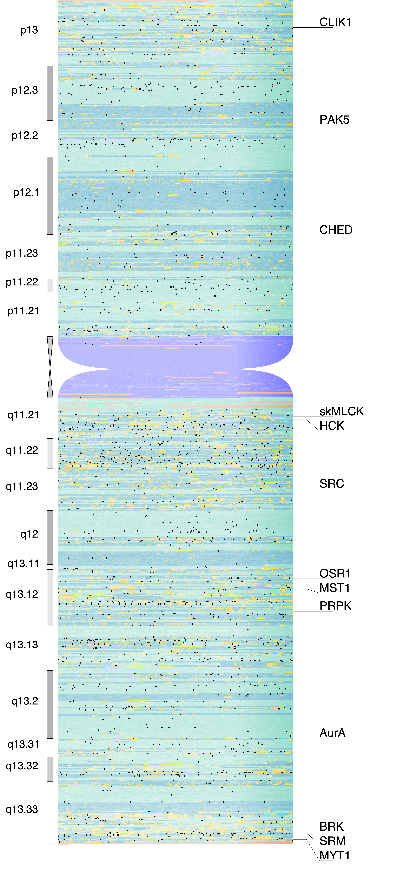

## GenomePlotter

[](https://codecov.io/gh/DSuveges/GenomePlotter)

The motivation behind this project was to create a scientifically correct visualization of the human genome with showing the location of genes, exons, already published genome-wide associations and many more. I chose a heat-map kind of visualization that allows the representation of the underlying chemical properties of the DNA ([GC content](https://en.wikipedia.org/wiki/GC-content)) as well.

### Approach

The project is divided into several steps:

1. `prepare-data` — downloads and pre-processes the source data files: genome sequence, GWAS signals, gene annotation and the [cytological bands](https://en.wikipedia.org/wiki/G_banding).
2. `plot-chromosome` — integrates sequence data and gene annotation into a PNG (and optionally SVG) for a single chromosome.
3. `plot-gene-arrow` — renders a gene structure diagram (exons, UTRs, strand direction) for a given gene.
4. `make-poster` — composites all per-chromosome PNGs into a two-row genome poster.

### Requirements

**Required command line tools:**

- [cairo graphics library](https://www.cairographics.org/download/)
- [bedtools](http://bedtools.readthedocs.io/en/latest/content/installation.html) v2.27 or above
- [uv](https://docs.astral.sh/uv/)

### Installing package:

```bash
# Cloning repo:
git clone https://github.com/DSuveges/GenomePlotter

# Creating environment:
cd GenomePlotter
uv sync --all-extras
```

### Source data:

As input, the most recent datasets are pulled from the respected sources as part of the data preparation process. All source data are mapped to the GRCh38 build of the human genome.

- **The sequence of the human genome** is dowloaded from [Ensembl](http://www.ensembl.org/info/data/ftp/index.html) (checking for the most recent version).
- **Genome wide association signals** most recent version of the NHGRI-EBI [GWAS catalog](https://www.ebi.ac.uk/gwas/) (checking the most recent version).
- **Gene annotation** the most recent gene coordinates are downloaded from [GENCODE](http://www.gencodegenes.org/releases/current.html).
- **Canonical transcripts** of protein coding genes are defined according to [Ensembl](https://www.ensembl.org/Help/Glossary).
- **Cytological bands** coordinates fetched from the Ensembl [REST API](http://rest.ensembl.org/).

More information on the sources can be found in the `config.yaml` configuration file.

### Step 1 - Pre-processing

```bash
uv run prepare-data -d data_folder/ -s 450 -t 0.5
```

help output:

```text
usage: prepare-data [-h] -d DATADIR [-c CONFIG] -s CHUNK_SIZE -t TOLERANCE

This script fetches and parses input data for the genome plotter project

options:
  -h, --help            show this help message and exit
  -d, --dataDir DATADIR
                        Folder into which the input data and the temporary
                        files will be saved
  -c, --config CONFIG   JSON file with configuration data. If not provided,
                        the default config bundled with the package is used.
  -s, --chunk_size CHUNK_SIZE
                        Chunk size to pool genomic sequence in base pairs.
  -t, --tolerance TOLERANCE
                        Fraction of a chunk that cannot be N.
```

- **DATADIR** folder into which the files are going to be saved.
- **CONFIG** optional path to a custom YAML configuration file. The default config bundled with the package is used when omitted.
- **CHUNK_SIZE** the length of non-overlapping window used to pool together to calculate [GC content](https://en.wikipedia.org/wiki/GC-content). In basepairs.
- **TOLERANCE** Ns are discarded from the GC content calculation. This float (ranging from 0-1) shows the maximum of Ns in a chunk tolerated. Chunks with too high N ratio is considered as heterochromatic region on the plot.


### Step 2 - Generate chromosome plot

```bash
uv run plot-chromosome --help
```

```text
usage: plot-chromosome [-h] -c CHROMOSOME [-w WIDTH] [-p PIXEL] [-s DARKSTART]
                       [-m DARKMAX] -f FOLDER [--textFile] [-g GENEFILE]
                       [-t TEST] [--dummy] --config CONFIG

Script to plot genome chunks colored based on GC content and gene annotation.
See github: https://github.com/DSuveges/GenomePlotter

options:
  -h, --help            show this help message and exit
  -c, --chromosome CHROMOSOME
                        Selected chromosome to process
  -w, --width WIDTH     Number of chunks in one row.
  -p, --pixel PIXEL     The size of a plotted chunk in pixels (default: 3).
  -s, --darkStart DARKSTART
                        Fraction of the width from where the colors start
                        getting darker (default: 0.75).
  -m, --darkMax DARKMAX
                        How dark a pixel can get at the right end of the plot
                        (default: 0.15).
  -f, --folder FOLDER   Folder into which the plots are saved.
  --textFile            Flag to indicate if svg file should also be saved.
  -g, --geneFile GENEFILE
                        A .bed file with genes to add to the chromosome.
  -t, --test TEST       The number of chunks to be read (by default the whole
                        chromosome is processed.)
  --dummy               If instead of the chunks, a dummy is drawn with
                        identical dimensions
  --config CONFIG       Specifying YAML file containing custom configuration
```

The script at first assigns GENCODE feature to each chunk as follows: the default value is intergenic, if a chunk has at least one base overlap with a gene then the chunk is considered to be gene, unless the chunk has at least one basepair overlap with an exon in which case the cunk is consideret to be exon, unless the GC content is NA, in which calse the chunk is considered to be heterochromatin. Based on cyto-band annotation, chunks overlapping with centromeres will be colored accordingly. The default color is adjusted based on the GC content.

Then genome-wide association signals are added as black dots. The size of the dots depends on the number of independent associations on a given chunk. Then cytological bands are added on the left side of the chromosome. Finally, if a gene set is given, the genes on the given chromosome are marked on the right side of the chromosome.

Finally the `.png` file is saved (and `.svg` file if required).

### Step 3 - Generate gene arrow plot

The `plot-gene-arrow` command generates a gene structure diagram (arrow plot) for a specific gene, showing its exons, UTRs, and strand direction.

```bash
uv run plot-gene-arrow --gene TSPAN6 --data_folder data_folder/ --config config.yaml
```

help output:

```text
usage: plot-gene-arrow [-h] -g GENE -d DATA_FOLDER -c CONFIG [-o OUTPUT]
                       [-s SCALE_FACTOR]

Generate an arrow plot (gene structure diagram) for a given gene. See github:
https://github.com/DSuveges/GenomePlotter

options:
  -h, --help            show this help message and exit
  -g, --gene GENE       Gene name (e.g. BRCA1)
  -d, --data_folder DATA_FOLDER
                        Path to the data folder containing processed files
  -c, --config CONFIG   Path to config YAML file
  -o, --output OUTPUT   Output file basename (defaults to {gene_name}_arrow)
  -s, --scale-factor SCALE_FACTOR
                        Scaling factor applied to all plot dimensions
                        (default: 30)
```

The script reads the pre-processed GENCODE arrow file from the data folder (generated in Step 1), filters it for the requested gene, and renders the gene structure as an SVG and PNG. Both files are saved using the output basename.

**Examples:**

```bash
# Generate arrow plot for TSPAN6 using default output name (TSPAN6_arrow.svg / TSPAN6_arrow.png):
uv run plot-gene-arrow -g TSPAN6 -d data_folder/ -c config.yaml

# Specify a custom output basename:
uv run plot-gene-arrow -g BRCA1 -d data_folder/ -c config.yaml -o plots/BRCA1_structure

# Adjust scale factor:
uv run plot-gene-arrow -g TP53 -d data_folder/ -c config.yaml -s 20
```

### Step 4 - Compose genome poster

The `make-poster` command composites all per-chromosome PNGs into a single two-row poster image.

```bash
uv run make-poster --folder data_folder/
```

help output:

```text
usage: make-poster [-h] -f FOLDER [-o OUTPUT] [-w WIDTH] [--font FONT]

Compose per-chromosome PNGs into a two-row genome poster.

options:
  -h, --help           show this help message and exit
  -f, --folder FOLDER  Directory containing chr<N>.png files (same folder used
                       by plot-chromosome).
  -o, --output OUTPUT  Output file path (default: <folder>/genome_poster.png).
  -w, --width WIDTH    Target pixel width of each chromosome column (default:
                       380).
  --font FONT          Path to a TrueType/OpenType font file for labels. Auto-
                       detected from common system locations if omitted.
```

The poster arranges chromosomes in two rows: chr1–12 (top-aligned) in the first row and chr22 + chr13–21 + chrX/chrY stacked (bottom-aligned) in the second. Chromosome labels are rendered below each column. The output is a 150 DPI PNG saved as `genome_poster.png` in the data folder by default.

A system font is located automatically across macOS, Linux, and Windows. Use `--font` to specify an explicit TrueType/OpenType file if needed.

### Gene sets

The `gene_sets/` folder contains a set of files that can be used as gene annotation:

- *kinases_Hs.bed.gz*: list of kinase genes in the human genome, generated by `get_kinases.sh` script.
- *gene_w_drugs.tsv.gz*: list of genes for which approved drugs exists (where the mechanism of action is known) based on [OpenTargets tractability](https://docs.targetvalidation.org/getting-started/target-tractability) data.

### Result

The following image was created based on the data of chromosome 20, where 450 bp-s were averaged to get GC content, and 200 of these chunks were plotted in each row. The list of kinase genes are shown on the right side of the chromosome.



The combined plot showing the entire genome with all the protein kinases highlighted:


### TO-DOs

1. Extra script to generate figure legend also as a csv and png.
